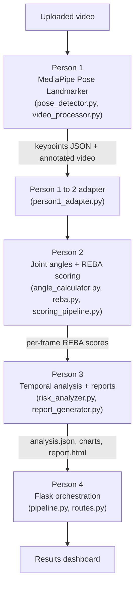

# ErgoScore

**Video-Based Ergonomic Posture Risk Assessment System**

ErgoScore analyzes a video of a person performing a work task and produces a REBA (Rapid Entire Body Assessment) ergonomic risk report — a score timeline, a risk-level breakdown, the worst observed posture moments with real extracted frame images, and rule-based recommendations — all through a single-page Flask dashboard.

This is a hackathon MVP built by a 4-person team. Pose detection, angle/REBA scoring, temporal analysis, and the Flask application are separate modules wired together through one integration point: `app/pipeline.py`.

---

## 1. Problem Statement

Musculoskeletal disorders caused by poor posture are one of the most common sources of workplace injury, especially in manual and repetitive jobs (manufacturing, warehousing, assembly lines). Formal ergonomic assessment methods like REBA exist and are well validated, but they normally require a trained human observer to watch a task and manually score body angles — which is slow, subjective, and rarely done outside large organizations.

Small teams and workplaces need a low-cost, camera-only way to get an objective, repeatable ergonomic risk score from ordinary video, without specialized motion-capture hardware.

## 2. Solution / How ErgoScore Works

A user uploads a short video of someone performing a task and selects two contextual inputs — **Load** (how heavy the handled object is) and **Coupling** (how good the hand grip is). ErgoScore then runs the video through four stages:

1. **Pose detection** — MediaPipe's Pose Landmarker model extracts body keypoints for every frame.
2. **Angle calculation + REBA scoring** — joint angles (trunk, neck, arms, knees) are computed from those keypoints and converted into a REBA score for every frame using the standard REBA lookup tables.
3. **Temporal analysis** — the per-frame scores are smoothed over time, summarized into statistics and a risk-level breakdown, and the worst moments are identified.
4. **Dashboard** — Flask renders everything into an interactive results page: the source video, a score timeline chart, a risk-distribution chart, the worst-posture frames (as real extracted JPEG snapshots), and a short list of rule-based recommendations.

## 3. Key Features

- Single-camera video upload (`.mp4`, `.mov`, `.avi`, `.webm`, `.mkv`)
- Real MediaPipe Pose Landmarker detection (VIDEO mode, 33-point topology; 13 landmarks are used)
- Deterministic REBA scoring on every usable frame, driven by the full standard REBA Tables A, B, and C
- Temporal smoothing, summary statistics, and a 3-level risk distribution (Low / Medium / High)
- The five worst posture moments, each with a real cropped snapshot pulled from the actual uploaded video
- Rule-based ergonomic recommendations generated from the specific REBA components (trunk, neck, arms, wrist, legs) that drove the worst scores
- An annotated, skeleton-overlaid copy of the processed video
- A generated HTML report with charts, saved to disk independently of the live dashboard
- Runs fully offline/locally — no external APIs or cloud services

## 4. System Architecture / Pipeline



`app/pipeline.py` is the single function (`analyze_video`) that calls all three stages in order and assembles the dictionary the dashboard renders — there is no dummy data left in this path; every field is derived from the actual video.

## 5. Technology Stack

| Layer | Technology |
|---|---|
| Web framework | Flask 3, Werkzeug |
| Pose detection | MediaPipe **Task API** (`PoseLandmarker`, VIDEO running mode) with the bundled `models/pose_landmarker.task` model |
| Video I/O | OpenCV (`opencv-python`, `opencv-contrib-python`) |
| Numerical work | NumPy |
| Report charts (server-generated PNGs) | Matplotlib |
| Dashboard charts (in-browser) | Chart.js (loaded from CDN), rendered as a line chart (score timeline) and a doughnut chart (risk distribution) |
| Testing | pytest |

No database, authentication, external ML API, or cloud service is used anywhere in the project.

## 6. Project Structure

```
ErgoScore/
├── app/
│   ├── __init__.py          # Flask app factory, config, error handlers
│   ├── config.py            # Paths, required landmark map, PoseConfig thresholds
│   ├── pose_detector.py     # MediaPipe PoseLandmarker wrapper (Person 1)
│   ├── video_processor.py   # Video -> per-frame landmarks -> JSON + annotated video (Person 1)
│   ├── schemas.py           # JSON-serializable data classes for Person 1 output
│   ├── person1_adapter.py   # Converts Person 1 JSON into Person 2's landmark format
│   ├── angle_calculator.py  # Trunk/neck/arm/knee joint-angle geometry (Person 2)
│   ├── reba.py              # Full REBA Tables A/B/C + scoring functions (Person 2)
│   ├── scoring_pipeline.py  # Runs angle calc + REBA per frame (Person 2)
│   ├── risk_analyzer.py     # Smoothing, statistics, risk distribution, worst frames (Person 3)
│   ├── report_generator.py  # Score-timeline & risk PNGs + HTML report (Person 3)
│   ├── pipeline.py          # analyze_video() -- orchestrates all 3 stages (Person 4)
│   └── routes.py            # GET /, POST /analyze, video/report-serving routes (Person 4)
├── models/
│   └── pose_landmarker.task # MediaPipe Pose Landmarker model file (required, see below)
├── templates/                # index.html (upload), results.html (dashboard), error.html
├── static/
│   ├── css/style.css
│   └── js/app.js             # Chart.js rendering for the dashboard
├── videos/
│   ├── uploads/               # Uploaded source videos
│   └── processed/             # Skeleton-annotated output videos
├── data/keypoints/            # Per-video keypoint JSON, metadata JSON, and REBA score JSON
├── reports/<video_name>/      # analysis.json, score_timeline.png, risk_distribution.png, report.html, snapshots/
├── tests/test_app.py          # Flask route tests (see Testing section -- currently outdated)
├── test_person2.py            # Manual smoke script for the angle/REBA scoring module
├── run.py                     # Flask app entry point
├── run_pose.py                # Standalone CLI for Person 1 (pose extraction only)
└── requirements.txt
```

## 7. Detailed Workflow

1. User opens the app and uploads a video, selecting **Load** (none/light/medium/heavy) and **Coupling** (good/fair/poor).
2. Flask saves the video to `videos/uploads/`.
3. `analyze_video()` in `pipeline.py` runs:
   - **Person 1** (`process_video`): decodes the video frame-by-frame with OpenCV, runs MediaPipe pose detection on each frame, writes a skeleton-annotated copy to `videos/processed/`, and writes per-frame landmark JSON + metadata to `data/keypoints/`.
   - **Adapter**: converts Person 1's landmark JSON into the flat `[x, y]` format Person 2 expects.
   - **Person 2** (`process_keypoints`): computes joint angles per frame and converts them into a REBA score using the standard REBA tables. Frames without enough usable landmarks are skipped, not guessed.
   - **Person 3** (`analyze_scores`): applies temporal smoothing, computes statistics and the risk distribution, and finds the five worst-scoring frames.
   - **Person 4**: extracts real snapshot images for those worst frames directly from the uploaded video, generates rule-based recommendations, and builds the summary text.
4. The dashboard is rendered with all of the above.

## 8. Pose Detection

Pose detection uses MediaPipe's current **Task API** (`mediapipe.tasks.python.vision.PoseLandmarker`), not the older/deprecated `mp.solutions.pose` API, running in **VIDEO** mode with monotonically increasing per-frame timestamps.

- The model file used is **`models/pose_landmarker.task`**, loaded once per video and reused across every frame.
- Out of MediaPipe's full 33-point topology, ErgoScore uses **13 required landmarks**: nose, both shoulders, elbows, wrists, hips, knees, and ankles.
- A landmark is only accepted if its MediaPipe **visibility ≥ 0.5**; otherwise it is treated as **not detected** (`None`) for that frame -- nothing is guessed or interpolated.
- If MediaPipe detects more than one person in a frame, ErgoScore deterministically keeps the one with the largest bounding-box area (closest/most prominent), since the system is designed around a single worker in frame.
- Accepted landmarks are optionally smoothed across frames with a per-landmark exponential moving average (default weight 0.4 on the new frame). If a landmark disappears and later reappears, its smoothing state resets rather than "jumping" from a stale value.
- Each frame gets a documented `pose_quality` score (0-1): half from how many of the 13 required landmarks were available, half from their average visibility. This is an engineering heuristic, not an accuracy guarantee.
- A copy of the video is written to `videos/processed/` with the detected skeleton drawn over it (or a "NO POSE" label on frames where nobody was detected).

## 9. Joint Angle Calculation

From the 13 landmarks, `angle_calculator.py` computes, per frame:

- **Trunk angle** -- deviation of the hip-to-shoulder vector from the hip-to-knee vector (falls back to vertical if knees aren't visible).
- **Neck angle** -- deviation between the trunk direction and the shoulder-to-nose (head) direction; capped at 60°, since this is a 2D screening proxy rather than a true anatomical neck-joint angle.
- **Upper-arm angle** -- angle at the shoulder between the elbow and the hip.
- **Elbow angle** -- angle at the elbow between the shoulder and the wrist.
- **Knee angle** -- angle at the knee between the hip and the ankle, calculated independently for each leg.

If both arms are visible in a frame, the side with the larger (more demanding) upper-arm angle is used for scoring. All angle functions return `None` -- not a fabricated number -- whenever a required landmark is missing.

## 10. REBA Scoring

`reba.py` is a **deterministic, rule-based** implementation of the REBA method (Hignett & McAtamney, 2000) -- no machine-learning model decides the score. It implements REBA Tables A, B, and C exactly as published, plus the load, coupling, and activity adjustments, and returns a final score from 1-15.

**What is measured from the video vs. set as an engineering default**, per frame:

| REBA input | Source |
|---|---|
| Trunk score | Measured trunk angle |
| Neck score | Measured neck angle |
| Legs score | Measured knee angle (or base score only if no knee is detected -- see below) |
| Upper-arm score | Measured upper-arm angle |
| Lower-arm (forearm) score | Measured elbow angle |
| Load/force score | User's **Load** selection on the upload form |
| Coupling score | User's **Coupling** selection on the upload form |
| Wrist score | **Not measured** -- no hand/wrist landmarks are used, so wrist angle defaults to 0° for every frame |
| Twisting / side-bending / shoulder-raised / arm-supported / wrist-deviated / static / repetitive / rapid-unstable flags | **Not detected from video** -- all default to `False`, so the activity-score adjustment is always 0 |

This means the current REBA score is driven by real trunk, neck, upper-arm, forearm, and (when available) leg posture, plus the load/coupling the user chooses -- but not by wrist deviation, twisting, or activity pattern, since those aren't derived from the pose data in this build.

## 11. Temporal Risk Analysis

`risk_analyzer.py` takes the list of per-frame REBA scores and:

- Applies a **centered moving average** (default window = 5 frames) to produce a smoothed score sequence, keeping the raw scores intact alongside it.
- Computes summary statistics: frame count, video duration (from actual timestamps, not an assumed frame rate), average score, minimum, and maximum.
- Buckets every **raw** REBA score into a simplified 3-category risk distribution:

  | Bucket | REBA score range |
  |---|---|
  | Low | 1-3 |
  | Medium | 4-7 |
  | High | 8-15 |

  (This collapses REBA's standard 5-level action scale -- Negligible/Low/Medium/High/Very High -- into 3 buckets for dashboard readability. The full 5-level classification is still available per-frame in each worst frame's REBA breakdown.)
- Finds the top-5 worst (highest raw REBA score) frames, enforcing a minimum 15-frame gap between selections so the five results represent distinct moments rather than five consecutive frames of the same posture.

## 12. Dashboard and Visualization

The results page (`templates/results.html`) includes:

- **REBA Assessment** -- the overall score and risk badge (based on the *maximum* observed frame score).
- **Posture Risk Over Time** -- a Chart.js line chart of the smoothed score timeline.
- **Risk Distribution** -- a Chart.js doughnut chart of the Low/Medium/High percentage breakdown.
- **Worst Posture Frames** -- up to 5 cards, each with the real extracted JPEG snapshot, timestamp, raw REBA score, and the trunk/neck/knee angles observed at that moment.
- **Observed Posture Metrics** -- the angle values from the single highest-risk selected moment.
- **Ergonomic Recommendations** -- see below.
- **Assessment Summary** -- a short factual paragraph.
- **Recorded Task** -- the original uploaded video, playable inline.

## 13. Ergonomic Recommendations

`pipeline.py`'s recommendation logic is **rule-based**, not machine-learned. It looks across the five selected worst frames, takes the *maximum* REBA component score seen for each body part (trunk, neck, legs, upper arm, lower arm, wrist), and triggers a recommendation once a component crosses a fixed threshold -- for example, a trunk component score >= 3 triggers a "reduce trunk flexion" recommendation, quoting the peak trunk angle actually observed. Recommendations are tagged **High / Medium / Info** priority, sorted by priority, and capped at 5. If no component crosses its threshold, a generic "maintain observed posture" or "review the selected moments" message is shown instead.

## 14. Handling Missing Landmarks / Limitations of Detection

- If MediaPipe cannot see the **trunk** (both hips + both shoulders) or the **neck** (nose + trunk) landmarks well enough in a frame, that frame is **skipped entirely** -- it is not scored with guessed values.
- If **knee landmarks are not detected** in a frame, no knee angle is invented. `scoring_pipeline.py` passes `None` to the REBA leg scorer, which then uses only the base leg posture score (bilateral vs. unilateral weight-bearing) with no knee-flexion adjustment -- this is documented behavior in `reba.py`'s `score_legs()`, not a bug. The dashboard shows the knee angle as unavailable in this case rather than displaying a fabricated value.
- If a video produces **zero scoreable frames** (e.g., the person is never clearly visible), the pipeline raises a clear error and the dashboard shows a friendly message asking for a video with a clearly visible, unobstructed person, instead of crashing or showing empty results.

## 15. Single-Camera 2D Limitation

ErgoScore uses a **single, uncalibrated 2D camera view**. All angles are computed from 2D image-plane coordinates, not true 3D joint angles. This means:

- Accuracy depends heavily on camera placement -- a clean side-on view of the worker gives the most reliable trunk/arm/knee angles; awkward or partially front-on angles can distort the measured angles.
- Depth-dependent postures (e.g., trunk twisting toward or away from the camera) cannot be reliably measured in 2D, which is part of why twisting/side-bending flags are not auto-detected (see Section 10).
- This is a screening aid, not a clinically validated measurement device -- it does not replace an in-person ergonomic assessment by a qualified professional.

## 16. Installation

### Requirements
- Python 3.10+ (project developed against a recent CPython 3.x)
- The dependencies pinned in `requirements.txt`: Flask, Werkzeug, mediapipe, opencv-python, opencv-contrib-python, numpy, matplotlib, pytest, and their transitive dependencies.
- The MediaPipe model file at **`models/pose_landmarker.task`** must be present -- the app raises a clear error naming the expected path if it is missing. This file is already included in the repository.

### macOS / Linux
```bash
python -m venv venv
source venv/bin/activate
pip install -r requirements.txt
```

### Windows (PowerShell)
```powershell
python -m venv venv
venv\Scripts\Activate.ps1
pip install -r requirements.txt
```

## 17. How to Run

```bash
python run.py
```

Then open **http://127.0.0.1:5000** in a browser.

Person 1's pose extraction can also be run standalone from the command line, independent of the Flask app -- useful for debugging pose detection on its own:

```bash
python run_pose.py --input videos/uploads/my_video.mp4
```

## 18. How to Use

1. Open `http://127.0.0.1:5000`.
2. Choose a video file (`.mp4`, `.mov`, `.avi`, `.webm`, or `.mkv`) showing one person performing a task, ideally from a clear side-on angle.
3. Select **Load** and **Coupling** to match the task.
4. Click **Analyze Video** and wait -- processing time depends on video length and machine speed, since MediaPipe runs on every frame.
5. Review the dashboard: overall score, timeline, risk distribution, worst-frame snapshots, recommendations, and summary.
6. Click **Analyze another video** to run a new assessment.

## 19. Example Workflow

1. Upload a 15-second clip of a warehouse worker lifting a box, with **Load = Heavy** and **Coupling = Fair**.
2. ErgoScore detects the person in most frames and scores each one.
3. The timeline shows the REBA score rising during the actual lift and falling during upright walking.
4. The worst-frame cards show the moment of deepest trunk flexion during the lift, with the real cropped image and a trunk angle reading.
5. The recommendations panel flags "Reduce trunk flexion" since that component drove the peak score, and quotes the actual peak angle observed.

## 20. Testing

- **`test_person2.py`** -- a manual smoke script that loads a sample keypoints JSON and runs it through the angle/REBA scoring pipeline, printing the first result. Run with `python test_person2.py` (requires a sample file at the path referenced inside it).
- **`tests/test_app.py`** -- automated Flask route tests written using `pytest`. **These currently predate the full 3-module integration**: they post a fake (non-video) byte stream and assert on dashboard text that matches the earlier dummy-data build. Running `pytest` today shows some of these tests failing, because the real pipeline correctly rejects a file OpenCV cannot decode, and the dashboard's wording has since changed. This test file has not yet been updated for the integrated pipeline -- treat it as a known gap, not as evidence the app doesn't work.
- **Recommended verification for the demo**: manually run the app (`python run.py`) and upload a short real video of a visible person, as described in Section 18. Pose extraction alone can also be checked independently with `run_pose.py`.

## 21. Output / Results

A successful analysis writes the following to disk (paths shown for a video named `example.mp4`):

- `videos/processed/example_processed.mp4` -- skeleton-annotated video
- `data/keypoints/example_keypoints.json` -- per-frame landmark data (Person 1)
- `data/keypoints/example_metadata.json` -- run metadata (detection rate, processing FPS, warnings)
- `data/keypoints/example_scores.json` -- per-frame REBA scores (Person 2 -> Person 3 handoff)
- `reports/example/analysis.json` -- full temporal analysis (Person 3)
- `reports/example/score_timeline.png`, `reports/example/risk_distribution.png` -- server-rendered charts
- `reports/example/report.html` -- a standalone HTML report
- `reports/example/snapshots/frame_<n>.jpg` -- the extracted worst-frame images shown on the dashboard

## 22. Limitations

- Single 2D camera view only; no depth or multi-camera triangulation.
- Assumes one primary worker in frame; a second person is ignored, not analyzed separately.
- Wrist angle and several REBA modifier flags (twisting, side-bending, shoulder-raised, arm-supported, static/repetitive activity) are not derived from the video and use fixed defaults -- see Section 10.
- Accuracy is sensitive to camera angle, lighting, and occlusion, since it depends entirely on MediaPipe's 2D landmark visibility.
- The automated Flask test suite (`tests/test_app.py`) has not yet been updated to match the integrated pipeline (see Section 20).
- This is a screening aid built for a hackathon timeframe, not a validated clinical or safety-compliance tool.

## 23. Future Enhancements

- Detect hand/wrist landmarks (e.g., with MediaPipe Hands) to measure real wrist angle instead of defaulting to 0°.
- Infer trunk/neck twisting and side-bending from 3D world landmarks (already extracted by Person 1 but not yet used for this).
- Detect static posture and repetitive movement patterns across frames to populate the REBA activity score automatically.
- Support multiple people in frame with separate per-person scoring.
- Update `tests/test_app.py` to test the real integrated pipeline with a real short sample video, and add unit tests for `reba.py` and `risk_analyzer.py`.
- Camera-angle guidance or calibration to reduce sensitivity to viewpoint.

## 24. Team / Contributions

Built by a 4-person team, split by pipeline stage:

- **Person 1** -- `config.py`, `pose_detector.py`, `video_processor.py`, `schemas.py`: MediaPipe pose extraction.
- **Person 2** -- `angle_calculator.py`, `reba.py`, `scoring_pipeline.py`, `person1_adapter.py`: joint-angle geometry and REBA scoring.
- **Person 3** -- `risk_analyzer.py`, `report_generator.py`: temporal smoothing, statistics, and report generation.
- **Person 4** (Saranya) -- `app/__init__.py`, `routes.py`, `pipeline.py` (final integration), `templates/`, `static/`: Flask application, dashboard, and wiring the three modules together into `analyze_video()`.

## 25. License

No license file is currently included in this repository. Add a `LICENSE` file before publishing or submitting if a specific license is required by the hackathon.

---

## Quick Start (for judges)

```bash
git clone <this-repo-url>
cd ErgoScore
python -m venv venv && source venv/bin/activate   # Windows: venv\Scripts\Activate.ps1
pip install -r requirements.txt
python run.py
```

Open **http://127.0.0.1:5000**, upload a short video of one person doing a task (side-on view works best), pick Load/Coupling, click **Analyze Video**, and view the dashboard. Total time: under 2 minutes plus video processing time.
